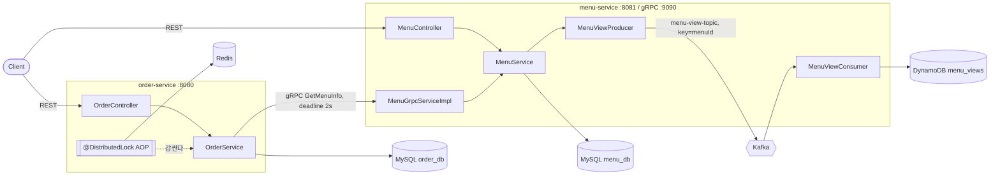

# Predictive KDS & Order Batching

> 주방에서 겪은 배치 조리 문제를 **신호 감지(Kafka) → 배치 처리 → 동시성 방어(Redis) → 성능 증명(k6) → 실무 구조화(gRPC/CI-CD)** 로 풀어내는 주방 디스플레이 시스템(KDS) 백엔드

피크타임에 같은 메뉴 주문이 따로따로 들어오면 주방은 같은 조리를 여러 번 반복합니다. 이 프로젝트는 "손님이 메뉴를 보는 순간"부터 신호를 모으고, 같은 메뉴 주문을 묶어 한 번에 조리하도록 안내하며, 주문이 몰려도 데이터가 꼬이지 않게 지키는 것을 목표로 합니다.

4주 계획으로 진행 중이며, **현재 2주차까지 구현되어 있습니다.**

## 진행 현황

| 주차 | 주제 | 상태 |
| --- | --- | --- |
| 1주차 | Spring Boot CRUD → Gradle 멀티모듈 분리 → gRPC 통신 | ✅ 완료 |
| 2주차 | Kafka + DynamoDB 이벤트 파이프라인, Redis 분산락 | ✅ 완료 |
| 3주차 | 배치 그룹핑, WebFlux/SSE 실시간 알림, Spring Batch 통계, Elasticsearch, Kotlin | ⏳ 예정 |
| 4주차 | k6 부하테스트, Resilience4j, Prometheus/Grafana/Loki, CI/CD, EC2 배포 | ⏳ 예정 |

## 아키텍처 (현재 구현 기준)



- **주문 생성**: `order-service`가 메뉴별 분산락을 잡고, gRPC로 `menu-service`에 메뉴 정보를 물어본 뒤 주문을 저장합니다.
- **메뉴 조회**: `menu-service`가 메뉴를 반환하면서 조회 이벤트를 Kafka에 발행하고, Consumer가 이를 DynamoDB에 적재합니다. 이벤트 발행·적재가 실패해도 메뉴 조회 자체는 정상 응답합니다.

## 기술 스택

| 구분 | 사용 기술 |
| --- | --- |
| 언어 / 프레임워크 | Java 17, Spring Boot 3.3.0, Spring Data JPA, Spring AOP |
| 빌드 | Gradle 9.7.1 (멀티모듈) |
| 서비스 간 통신 | gRPC 1.60.0, Protocol Buffers 3.25.3 |
| 메시징 | Apache Kafka 3.8.0 (KRaft 모드) |
| 저장소 | MySQL 8.0, DynamoDB Local, Redis 7.2 (Redisson 3.37.0) |
| 테스트 | JUnit 5, AssertJ, Mockito |

## 모듈 구조

```
kds-order
├── common          # menu.proto 및 생성된 gRPC stub (두 서비스가 공유하는 통신 규격)
├── menu-service    # 메뉴 CRUD, gRPC 서버, 조회 이벤트 Producer/Consumer, DynamoDB 적재
├── order-service   # 주문 CRUD, gRPC 클라이언트, @DistributedLock AOP
├── docker          # MySQL 초기화 스크립트 (menu_db, order_db 생성)
└── docs
    ├── decisions     # 설계 결정 기록 (ADR)
    ├── study-log     # 일일 학습 기록
    └── weekly-retro  # 주간 아키텍처 회고
```

`order-service`와 `menu-service`는 서로를 직접 참조하지 않고 `common`의 proto 규격으로만 대화합니다. 각 서비스는 자기 DB(`order_db`, `menu_db`)만 소유합니다.

## 실행 방법

**사전 준비:** JDK 17, Docker

```bash
# 1. 인프라 기동 (MySQL, Kafka, DynamoDB Local, Redis)
docker compose up -d

# 2. 서비스 기동 (터미널 2개)
./gradlew :menu-service:bootRun
./gradlew :order-service:bootRun
```

| 대상 | 포트 |
| --- | --- |
| order-service (REST) | 8080 |
| menu-service (REST) | 8081 |
| menu-service (gRPC) | 9090 |
| MySQL | 3307 |
| Kafka | 9092 |
| DynamoDB Local | 8000 |
| Redis | 6379 |

**테스트**

```bash
./gradlew test
```

`order-service`의 테스트는 `@SpringBootTest`라서 MySQL과 Redis가 떠 있어야 합니다. `menu-service`의 gRPC 테스트는 인프라 없이 실행됩니다.

## API

요청 값은 모두 쿼리 파라미터로 받습니다.

**Menu Service** (`http://localhost:8081`)

| Method | Path | 설명 |
| --- | --- | --- |
| POST | `/api/menus?name=&price=&cookingTime=` | 메뉴 생성 |
| GET | `/api/menus` | 메뉴 전체 조회 |
| GET | `/api/menus/{menuId}` | 메뉴 단건 조회 (조회 이벤트 발행) |
| PATCH | `/api/menus/{menuId}/price?newPrice=` | 가격 수정 |
| DELETE | `/api/menus/{menuId}` | 메뉴 삭제 |

**Order Service** (`http://localhost:8080`)

| Method | Path | 설명 |
| --- | --- | --- |
| POST | `/api/orders?menuId=&quantity=` | 주문 생성 (분산락 + gRPC 메뉴 조회) |
| GET | `/api/orders` | 주문 전체 조회 |
| GET | `/api/orders/{orderId}` | 주문 단건 조회 |
| PATCH | `/api/orders/{orderId}/status?status=` | 주문 상태 변경 (`PENDING`, `COOKING`, `COMPLETED`, `CANCELED`) |
| DELETE | `/api/orders/{orderId}` | 주문 삭제 |

**gRPC** (`common/src/main/proto/menu.proto`)

```protobuf
service MenuGrpcService {
  rpc GetMenuInfo (MenuRequest) returns (MenuResponse);
}
```

`MenuResponse`는 `menu_id`, `menu_name`, `price`, `cooking_time`, `menu_status`를 담습니다.

## 핵심 설계 결정

### 1. 단일 모듈로 시작해서 멀티모듈로 분리
처음부터 나누지 않고 단일 프로젝트로 CRUD를 완성한 뒤 `order-service` / `menu-service` / `common`으로 쪼갰습니다. 패키지 분리는 컴파일 시점의 격리를 강제하지 못하지만, Gradle 멀티모듈은 `build.gradle`에 선언하지 않은 모듈을 `import`조차 할 수 없어 의존성 경계가 물리적으로 지켜집니다.

### 2. 내부 통신은 gRPC + Deadline
서비스 간 호출은 Protocol Buffers 바이너리 직렬화와 HTTP/2 기반의 gRPC를 사용합니다. `menu-service`가 느려져도 `order-service`의 스레드가 묶이지 않도록 호출마다 2초 Deadline을 겁니다.

Deadline은 stub 빈 생성 시점이 아니라 **호출 시점마다** 새로 설정합니다. 빈 생성 시 걸어두면 앱 기동 2초 이후의 모든 호출이 즉시 타임아웃 나기 때문입니다 (`GrpcClientConfig`, `OrderService.fetchMenuInfo`).

### 3. 조회 이벤트는 Kafka로 분리하고 DynamoDB에 적재
메뉴 반환(핵심 흐름)과 조회 기록(부가 기능)을 분리했습니다.

- 파티션 키로 `menuId`를 사용해 같은 메뉴의 이벤트 순서를 보장합니다.
- Kafka 발행 실패와 DynamoDB 저장 실패는 각각 로그만 남기고 삼킵니다. 조회수는 일부 유실을 감수할 수 있는 데이터이고, 예외가 전파되면 메뉴 조회가 실패하거나 컨슈머가 같은 메시지를 무한 재시도하게 됩니다.
- 정합성이 중요한 주문·메뉴 데이터는 MySQL, 쓰기가 잦고 조회 패턴이 단순한 이벤트 로그는 DynamoDB(PK `menuId`, SK `viewedAt`)에 저장합니다.

### 4. `@DistributedLock` — 어노테이션 기반 분산락
메서드에 어노테이션만 붙이면 Redisson 락이 적용됩니다. 키는 SpEL로 메서드 인자를 참조합니다.

```java
@DistributedLock(key = "'MENU_ORDER_COUNT_LOCK_' + #menuId", waitTime = 10000, leaseTime = 3000)
@Transactional
public void increaseCount(Long menuId) { ... }
```

락 Aspect에는 `@Order(Ordered.HIGHEST_PRECEDENCE)`를 부여해 **락이 트랜잭션을 바깥에서 감싸도록** 했습니다. 실행 순서는 `락 획득 → 트랜잭션 시작 → 로직 → 커밋 → 락 해제`입니다.

### 5. 주문 항목 스냅샷 패턴 (설계만 완료)
주문 시점의 가격과 조리 정보를 주문 쪽에 복사해 두는 방식을 선택했습니다. 과거 주문 금액의 불변성을 지키고, 3주차 배치 그룹핑 때 매번 `menu-service`를 호출하지 않기 위해서입니다. 근거는 [ADR 001](docs/decisions/001-order-item-snapshot-pattern.md)에 있으며, 엔티티 구현은 3주차에 진행합니다.

## 트러블슈팅

### 분산락을 걸었는데도 데이터가 오염됨
- **증상:** 락을 적용했는데도 간헐적으로 카운트가 맞지 않음.
- **원인:** 락 AOP가 `@Transactional`보다 안쪽에서 실행되어, DB 커밋 전에 락이 먼저 풀렸습니다. 그 틈에 다른 스레드가 커밋되지 않은 옛 값을 읽었습니다.
- **해결:** 락 Aspect의 우선순위를 최상위로 올려 커밋이 끝난 뒤에 락이 풀리도록 순서를 강제했습니다.

### 100건을 보냈는데 98건만 반영되는 불안정한 테스트
- **증상:** 실행할 때마다 결과가 달라짐.
- **원인:** `ExecutorService.submit()`이 예외를 삼켜 원인이 보이지 않았습니다. `Future.get()`으로 예외를 끌어올리자 `락 획득 실패`가 드러났고, 줄 맨 뒤의 스레드가 `waitTime`을 넘겨 탈락한 것이었습니다.
- **해결:** `waitTime`을 0으로 줄여 실패를 의도적으로 재현해 원인을 확정한 뒤, "카운트는 누락 없이 처리되어야 한다"는 요구에 맞춰 `waitTime`을 10초로 늘렸습니다.

### `@annotation(파라미터)` 바인딩이 동시 호출에서 깨짐
- **증상:** 동시 호출 시 `Required to bind 2 arguments, but only bound 1` 예외가 무작위로 발생.
- **해결:** 포인트컷은 어노테이션 타입으로만 매칭하고, 어노테이션 값은 advice 안에서 리플렉션으로 직접 꺼내도록 바꿨습니다.

### Kafka 연결 오류 (`Connection to node -1 could not be established`)
- **원인:** Zookeeper 컨테이너가 먼저 죽으면서 Kafka가 연쇄 종료되었습니다.
- **해결:** Zookeeper가 필요 없는 KRaft 모드 이미지(`apache/kafka:3.8.0`)로 교체했습니다.

### 동시성 테스트 결과

| 조건 | 100건 동시 요청 결과 |
| --- | --- |
| 락 없음 | TBD (재현 수치 기록 예정) |
| 락 적용, `waitTime` 부족 | 98건 반영된 실행 관측 (결과가 매번 달라짐) |
| 락 적용, AOP 순서 미지정 | 간헐적 오염 |
| 락 적용, `waitTime` 10초 + `@Order` 최상위 | 100건 반영 (`OrderCountServiceTest`) |

## 알려진 한계

- **로컬 모듈 분리 수준입니다.** 서비스 디스커버리 없이 주소를 설정 파일에 고정했고, 실제 다중 서버 배포는 아닙니다.
- **주문 생성과 주문 수 카운트가 아직 연결되어 있지 않습니다.** `OrderCountService.increaseCount`는 동시성 검증용으로 단독 테스트되며, `createOrder`에서 호출하지 않습니다.
- **주문 생성 시 품절 여부를 검증하지 않습니다.** gRPC 응답에 `menu_status`를 채우지 않아 항상 기본값(`AVAILABLE`)이 내려갑니다.
- **`createOrder`는 락과 트랜잭션을 잡은 채로 gRPC를 호출합니다.** `menu-service`가 느려지면 락 점유 시간이 함께 늘어납니다.
- **gRPC 재시도가 없습니다.** 현재는 Deadline만 적용되어 있고, 서킷브레이커는 4주차에 추가합니다.
- **DynamoDB 핫파티션 가능성.** 파티션 키가 `menuId`라 인기 메뉴에 쓰기가 쏠릴 수 있습니다.
- **Consumer가 단건 처리입니다.** 메시지 1건당 `putItem` 1회이며, BatchListener + `batchWriteItem` 전환을 TODO로 남겼습니다.
- **Redis 장애 시 락을 획득할 수 없습니다.** 대체 경로는 없습니다.

## 로드맵

**3주차 — 배치 로직 + 실시간 알림 + 검색/통계**
- `BatchGroupingService`: 같은 메뉴 주문 그룹핑, 30초/1분/2분 윈도우 비교
- Notification Service(WebFlux) + SSE로 KDS 화면에 실시간 알림
- Spring Batch 일일 통계 (절감된 조리 사이클 수 등)
- Elasticsearch 주문 이력 색인·검색
- 모듈 하나를 Kotlin + Kotest로 재작성

**4주차 — 성능 증명 + 장애 대응 + 배포 자동화**
- k6로 배치 적용 전/후 부하테스트
- Order → Menu gRPC 호출부에 Resilience4j 서킷브레이커
- Actuator + Micrometer, Prometheus / Grafana / Loki
- CI/CD 파이프라인, EC2 자동 배포

## 문서

- [설계 결정 기록 (ADR)](docs/decisions)
- [주간 아키텍처 회고](docs/weekly-retro)
- [일일 학습 기록](docs/study-log)
